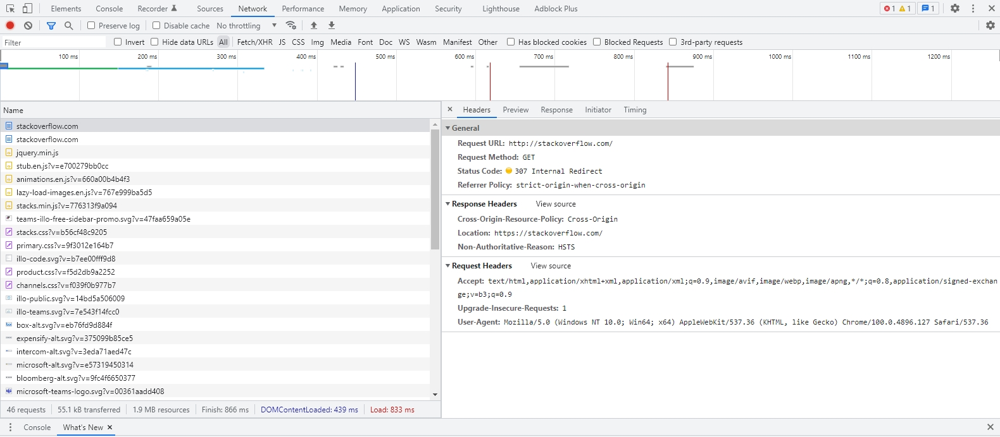
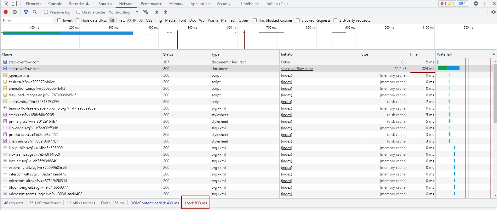

# 3.6. Компьютерные сети, лекция 1-Яковлев В.С._ДЗ_11

#### 1. Работа c HTTP через телнет.
- Подключитесь утилитой телнет к сайту stackoverflow.com telnet stackoverflow.com 80
- отправьте HTTP запрос
```bash
GET /questions HTTP/1.0
HOST: stackoverflow.com
[press enter]
[press enter]
```
- В ответе укажите полученный HTTP код, что он означает?

Решение
```bash
[root@Git-SentOS-8 ~]# telnet stackoverflow.com 80
Trying 151.101.1.69...
Connected to stackoverflow.com.
Escape character is '^]'.


GET /questions HTTP/1.0
HOST: stackoverflow.com

HTTP/1.1 301 Moved Permanently
cache-control: no-cache, no-store, must-revalidate
location: https://stackoverflow.com/questions
x-request-guid: 66e8203c-73d0-487d-9131-4236d03caa06
feature-policy: microphone 'none'; speaker 'none'
content-security-policy: upgrade-insecure-requests; frame-ancestors 'self' https://stackexchange.com
Accept-Ranges: bytes
Date: Fri, 22 Apr 2022 18:54:41 GMT
Via: 1.1 varnish
Connection: close
X-Served-By: cache-hhn4070-HHN
X-Cache: MISS
X-Cache-Hits: 0
X-Timer: S1650653681.253830,VS0,VE171
Vary: Fastly-SSL
X-DNS-Prefetch-Control: off
Set-Cookie: prov=e24c4827-e7bd-8c95-0386-2372f370d03f; domain=.stackoverflow.com; expires=Fri, 01-Jan-2055 00:00:00 GMT; path=/; HttpOnly
```

Получили код 301, что означает редирект. Редирект производится с протокола http на https. url адрес тот же.

#### 2. Повторите задание 1 в браузере, используя консоль разработчика F12.
- откройте вкладку Network
- отправьте запрос http://stackoverflow.com
- найдите первый ответ HTTP сервера, откройте вкладку Headers
- укажите в ответе полученный HTTP код.
- проверьте время загрузки страницы, какой запрос обрабатывался дольше всего?
- приложите скриншот консоли браузера в ответ.

 Решение



Получили код 307 Internal Redirect



Страница полностью загрузилась за 833 мс. Самый долгий запрос - начальная загрузка страницы 324 мс

#### 3. Какой IP адрес у вас в интернете?

Решение

```bash
[root@Git-SentOS-8 ~]# dig @resolver4.opendns.com myip.opendns.com +short
46.160.XXX.XXX   
```
#### 4. Какому провайдеру принадлежит ваш IP адрес? Какой автономной системе AS? Воспользуйтесь утилитой whois?

Решение

```bash 
[root@Git-SentOS-8 ~]# whois 46.160.XXX.XXX | grep ^descr
descr:          MIR broadband customers
descr:          MIR customers
```
IP адрес принадлежит MIR broadband customers, MIR customers
```bash
[root@Git-SentOS-8 ~]# whois 46.160.XXX.XXX | grep ^origin
origin:         AS35539
```
AS - AS35539

#### 5. Через какие сети проходит пакет, отправленный с вашего компьютера на адрес 8.8.8.8? Через какие AS? Воспользуйтесь утилитой traceroute

Решение

```bash
[root@Git-SentOS-8 ~]# traceroute -An 8.8.8.8
traceroute to 8.8.8.8 (8.8.8.8), 30 hops max, 60 byte packets
 1  192.168.1.3 [*]  0.931 ms  0.926 ms  0.913 ms
 2  46.160.230.1 [AS35539]  286.146 ms  286.129 ms  286.080 ms
 3  93.123.162.154 [AS35539]  285.947 ms  285.893 ms  285.842 ms
 4  93.123.162.97 [AS35539]  285.776 ms  285.725 ms  285.678 ms
 5  93.123.162.141 [AS35539]  2.191 ms  2.271 ms  2.434 ms
 6  93.123.156.62 [AS35539]  1.961 ms  2.250 ms  2.341 ms
 7  93.123.156.89 [AS35539]  2.129 ms  2.155 ms  2.292 ms
 8  93.123.156.26 [AS35539]  1.882 ms  1.820 ms  1.832 ms
 9  72.14.197.189 [AS15169]  2.475 ms  2.492 ms  2.438 ms
10  * * *
11  72.14.233.90 [AS15169]  2.232 ms * 172.253.69.166 [AS15169]  1.993 ms
12  108.170.250.51 [AS15169]  2.218 ms 108.170.250.146 [AS15169]  2.218 ms 108.170.250.34 [AS15169]  3.014 ms
13  142.250.238.214 [AS15169]  16.719 ms 209.85.255.136 [AS15169]  19.761 ms 172.253.66.116 [AS15169]  20.074 ms
14  172.253.66.110 [AS15169]  19.815 ms  19.839 ms 72.14.232.86 [AS15169]  14.529 ms
15  172.253.51.247 [AS15169]  16.974 ms 172.253.51.239 [AS15169]  16.842 ms 142.250.210.103 [AS15169]  19.289 ms
16  * * *
17  * * *
18  * * *
19  * * *
20  * * *
21  * * *
22  * * *
23  * * *
24  * * *
25  8.8.8.8 [AS15169]  17.260 ms *  17.237 ms
``` 
Пакет проходит через AS - AS35539, AS15169

#### 6. Повторите задание 5 в утилите mtr. На каком участке наибольшая задержка - delay? Сможете ли вы наблюдать выводимые данные?

Решение
```bash
[root@Git-SentOS-8 ~]# mtr 8.8.8.8 -znrc 1
Start: 2022-04-22T23:43:56+0300
HOST: Git-SentOS-8.local          Loss%   Snt   Last   Avg  Best  Wrst StDev
  1. AS???    192.168.1.3          0.0%     1    0.5   0.5   0.5   0.5   0.0
  2. AS35539  46.160.230.1         0.0%     1    0.7   0.7   0.7   0.7   0.0
  3. AS35539  93.123.162.154       0.0%     1    0.7   0.7   0.7   0.7   0.0
  4. AS35539  93.123.162.97        0.0%     1    0.8   0.8   0.8   0.8   0.0
  5. AS35539  93.123.162.141       0.0%     1    1.2   1.2   1.2   1.2   0.0
  6. AS35539  93.123.156.62        0.0%     1    6.2   6.2   6.2   6.2   0.0
  7. AS35539  93.123.156.89        0.0%     1    2.8   2.8   2.8   2.8   0.0
  8. AS35539  93.123.156.26        0.0%     1    1.9   1.9   1.9   1.9   0.0
  9. AS15169  72.14.197.189        0.0%     1    2.5   2.5   2.5   2.5   0.0
  10. AS15169  142.251.64.109       0.0%     1    2.0   2.0   2.0   2.0   0.0
  11. AS15169  108.170.250.83       0.0%     1    2.1   2.1   2.1   2.1   0.0
  12. AS15169  72.14.234.54         0.0%     1   19.3  19.3  19.3  19.3   0.0
  13. AS15169  72.14.232.76         0.0%     1   16.6  16.6  16.6  16.6   0.0
  14. AS15169  172.253.51.245       0.0%     1   18.4  18.4  18.4  18.4   0.0
  15. AS???    ???                 100.0     1    0.0   0.0   0.0   0.0   0.0
  16. AS???    ???                 100.0     1    0.0   0.0   0.0   0.0   0.0
  17. AS???    ???                 100.0     1    0.0   0.0   0.0   0.0   0.0
  18. AS???    ???                 100.0     1    0.0   0.0   0.0   0.0   0.0
  19. AS???    ???                 100.0     1    0.0   0.0   0.0   0.0   0.0
  20. AS???    ???                 100.0     1    0.0   0.0   0.0   0.0   0.0
  21. AS???    ???                 100.0     1    0.0   0.0   0.0   0.0   0.0
  22. AS???    ???                 100.0     1    0.0   0.0   0.0   0.0   0.0
  23. AS???    ???                 100.0     1    0.0   0.0   0.0   0.0   0.0
  24. AS15169  8.8.8.8              0.0%     1   18.9  18.9  18.9  18.9   0.0
``` 
Наибольшая задержка на 12 хопе

#### 7. Какие DNS сервера отвечают за доменное имя dns.google? Какие A записи? воспользуйтесь утилитой dig

Решение
```bash
 [root@Git-SentOS-8 ~]# dig +short NS dns.google
ns3.zdns.google.
ns4.zdns.google.
ns1.zdns.google.
ns2.zdns.google.
```
NS записи

```bash
[root@Git-SentOS-8 ~]# dig +short A dns.google
8.8.8.8
8.8.4.4
```
A записи

#### 8. Проверьте PTR записи для IP адресов из задания 7. Какое доменное имя привязано к IP? воспользуйтесь утилитой dig

Решение 

```bash
[root@Git-SentOS-8 ~]# for ip in `dig +short A dns.google`; do dig -x $ip | grep ^[0-9].*in-addr; done
4.4.8.8.in-addr.arpa.   36833   IN      PTR     dns.google.
8.8.8.8.in-addr.arpa.   5787    IN      PTR     dns.google.
```

dns.google
